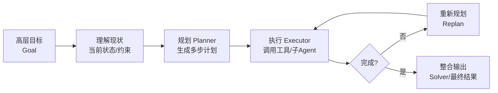
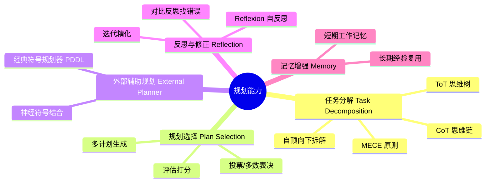
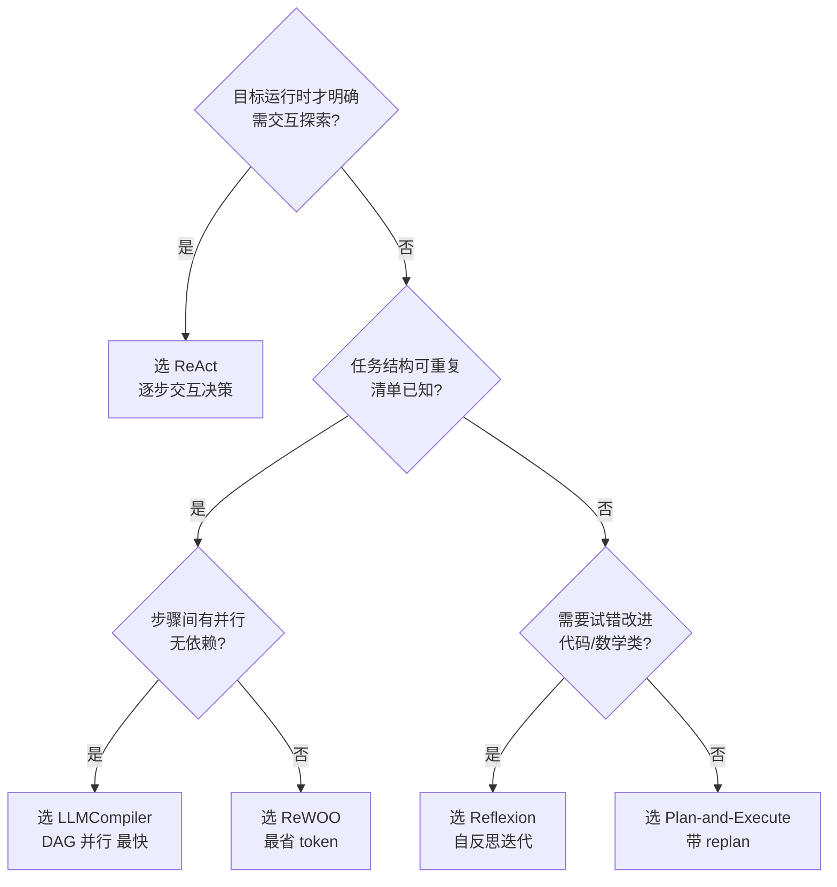

# 调研报告：如何设计一个优秀的 AI Agent 规划系统（Planning Skill）

> 调研时间：2026-07-03 ｜ 共参考 12+ 篇权威文献（含 arXiv 论文、LangChain 官方博客、吴恩达 Agentic Design Patterns、《智能体设计模式》第六章、Agent Skills 规范等）

---

## 一、核心概念：什么是「规划系统 Skill」

规划（Planning）是 **吴恩达提出的四大 Agentic 设计模式**之一（另三个为 Reflection 反思、Tool Use 工具使用、Multi-Agent Collaboration 多智能体协作）[[Andrew Ng, 2024](https://x.com/AndrewYNg/status/1779606380665803144); [augmentcode.com](https://www.augmentcode.com/guides/agentic-design-patterns)]。

其本质是：**用大语言模型（LLM）自主决定执行何种步骤序列，将复杂的高层目标（"做什么"）拆解为有序、可执行、可依赖管理的子步骤（"怎么做"）**，并在执行受阻时动态调整路线。



**规划系统的四个关键特征**（据《智能体设计模式》第六章 [[ginonotes.com](https://ginonotes.com/posts/agentic-design-patterns-planning-translation)]）：

| 特征 | 说明 |
|------|------|
| 目标驱动 | 接收"做什么"（目标声明），而非"怎么做"（具体指令），由 Agent 自主决定路径 |
| 即时生成 | 计划不是预存的，而是根据当前状态和目标**即时生成**的 |
| 灵活应变 | 初步计划只是出发点，能接纳新信息、动态调整 |
| 结构化分解 | 将复杂目标拆为子目标，按依赖关系排序处理 |

---

## 二、主流架构对比（核心选型依据）

业界已有成熟的几种规划 Agent 架构，**选型直接决定成本、延迟、可靠性三角**。LangChain 官方总结了三类典型设计 [[langchain.com](https://www.langchain.com/blog/planning-agents)]：

### 2.1 五大架构全景对比

| 架构 | 核心思想 | Token 成本 | 延迟 | 错误恢复 | 适用场景 |
|------|---------|-----------|------|---------|---------|
| **ReAct** | 思考→行动→观察循环，逐步决策 | 高（每步全量上下文） | 慢（串行） | 强（可中途调整） | 交互式、目标运行时才明确、需探索 |
| **Plan-and-Execute** | 先生成完整计划，再逐步执行，可重规划 | 中 | 中（串行） | 中（可 replan） | 中等复杂度、多步骤任务 |
| **ReWOO** (Reasoning w/o Observation) | 一次性规划，带变量占位符，无需逐步 LLM 调用 | **低（比 ReAct 省~80%）** | 较快（可并行） | 弱（计划固定，失败即硬失败） | 结构化、可重复的批处理 |
| **LLMCompiler** | 规划为 DAG，按依赖并行执行 | 低 | **最快（论文称 3.6×）** | 中 | 多工具并行、无依赖任务 |
| **Reflexion** | 执行后自反思，迭代改进 | 较高（多轮） | 慢 | 强（自纠错） | 代码生成、需要试错改进 |

### 2.2 ReAct vs ReWOO 的关键权衡（最常被问的选型问题）

据 Nutrient 的深度对比 [[nutrient.io](https://www.nutrient.io/blog/rewoo-vs-react-choosing-right-agent-architecture/)]：

- **HotpotQA 基准**：GPT-3.5 上 ReWOO 准确率 42.4% vs ReAct 40.8%，且 token 用量从 9,795 降至 ~2,000（**降低 80%**）。
- **ReAct 的优势**在于动态、交互式任务（实时文档对话、动态表单、探索性数据分析）——目标是运行时才明确的。
- **ReWOO 的优势**在于结构化、可重复工作流（批量文档处理、合规校验、报告生成）——清单是已知的。

### 2.3 混合架构（生产环境的现实选择）

单一架构都有短板，业界趋向**混合** [[nutrient.io](https://www.nutrient.io/blog/rewoo-vs-react-choosing-right-agent-architecture/)]：

1. **ReWOO 优先 + ReAct 兜底**：先用 ReWOO 批量执行，失败时降级为 ReAct 带上下文恢复。
2. **ReAct 探索 → ReWOO 规模化**：用 ReAct 在样本上"发现"字段结构，学到映射后切 ReWOO 流水线批量处理。
3. **ReAct 外壳 + ReWOO 内核**：ReAct 的高层动作内部封装一个 ReWOO 流水线（类似 supervisor 调用 subagent）。

---

## 三、设计优秀规划 Skill 的工程原则

这部分综合 **Agent Skills 最佳实践规范** [[agentskills.io](https://agentskills.io/skill-creation/best-practices)] 与渐进式披露设计模式 [[swirlai newsletter](https://www.newsletter.swirlai.com/p/agent-skills-progressive-disclosure)]。

### 3.1 规划 Skill 的三大工程价值

LangChain 指出规划架构相比朴素 ReAct 的三大改进 [[langchain.com](https://www.langchain.com/blog/planning-agents)]：

1. **更快** — 多步工作流无需每步都咨询大模型；子任务可用轻量 LLM 甚至无 LLM 调用。
2. **更省** — 子任务调用小模型/专用模型，大模型只在（重）规划与最终生成时调用。
3. **更好** — 强制规划器"通盘思考"所有步骤，显式推理全流程，任务完成率与质量更高。

### 3.2 七条核心设计原则

#### 原则 1：从真实专长中提取，而非凭空生成
不要让 LLM 凭通用训练知识写 Skill——结果是空洞泛泛的"妥善处理错误"。应从**真实任务执行轨迹**中提取：成功的步骤序列、你做的纠正、输入输出格式、项目特定约定 [[agentskills.io](https://agentskills.io/skill-creation/best-practices)]。

#### 原则 2：补充 Agent 不懂的，省略它已懂的
每个 Skill token 都在与上下文窗口里的一切争夺注意力。问自己："没有这条指令，Agent 会犯错吗？"答"否"就删掉。无需解释 PDF 是什么、HTTP 怎么工作 [[agentskills.io](https://agentskills.io/skill-creation/best-practices)]。

#### 原则 3：设计连贯的工作单元
Skill 的作用域像函数：要封装**一个连贯的工作单元**，能与其他 Skill 良好组合。太窄→单任务需加载多个 Skill（开销+冲突）；太广→难以精确激活 [[agentskills.io](https://agentskills.io/skill-creation/best-practices)]。

#### 原则 4：追求适度细节，而非穷尽文档
过于全面的 Skill 反而有害——Agent 难以提取相关内容，可能被不适用的指令误导走入歧途。**简洁的分步指导 + 一个可运行示例**通常胜过详尽文档 [[agentskills.io](https://agentskills.io/skill-creation/best-practices)]。

#### 原则 5：用渐进式披露（Progressive Disclosure）管理上下文
这是 Skill 设计的**核心架构模式**。规范建议：
- `SKILL.md` 保持在 **500 行 / 5000 token 以内**，只放每次运行都需要的核心指令 [[Towards AI, 2025](https://pub.towardsai.net/progressive-disclosure-in-ai-agent-skill-design-b49309b4bc07)]。
- 详细参考资料移到 `references/` 等目录。
- **关键是告诉 Agent 何时加载每个文件**："当 API 返回非 200 状态码时读取 `references/api-errors.md`"比泛泛的"详见 references/"有效得多。

```
my-planning-skill/
├── SKILL.md              # <500行，核心规划流程
├── references/
│   ├── decomposition-strategies.md   # 按需加载
│   ├── replan-heuristics.md          # 失败时加载
│   └── dependency-graph-format.md    # 构建DAG时加载
├── assets/
│   └── plan-template.yaml            # 输出格式模板
└── scripts/
    └── validate_plan.py              # 计划校验脚本
```

#### 原则 6：按脆弱性校准指令的具体度
- **多解合法、容差高的任务**→给自由度，解释"为什么"比死板指令更有效。
- **脆弱操作、需一致性、特定顺序**→要处方化（prescriptive）[[agentskills.io](https://agentskills.io/skill-creation/best-practices)]。

#### 原则 7：提供默认项，而非菜单
多种工具/方法都可行时，**选一个默认**并简短提替代，而不是把它们当作等价选项罗列。

### 3.3 规划 Skill 特有的高价值模式

| 模式 | 作用 | 示例 |
|------|------|------|
| **Plan-Validate-Execute** | 批量/破坏性操作先出中间计划，对照真相源校验，通过才执行 | 表单填充：先 `validate_fields.py` 校验字段名存在，再 `fill_form.py` |
| **Validation Loop（验证循环）** | 做→验证→修→重复直到通过 | 编辑后跑 `validate.py`，失败则据报错修后重跑 |
| **Checklist（清单）** | 多步工作流防漏步 | `- [ ] Step1... - [ ] Step2...` 带依赖门 |
| **Gotchas（陷阱清单）** | 列出违反合理假设的环境特定事实——最高价值内容 | "`users`表用软删除，查询必须 `WHERE deleted_at IS NULL`" |
| **Plan-Observe-Reflect 循环** | 规划→执行→观察→反思→改进的迭代闭环 [[emergentmind.com](https://www.emergentmind.com/topics/iterative-plan-observe-reflect-cycle)] | 代码生成：生成→跑测试→反思错误→改进重生成 |

---

## 四、规划系统的五大能力维度

据 LLM Agent 规划能力的系统综述 [[CSDN](https://blog.csdn.net/qq_27590277/article/details/140116139)]，规划能力可细分为五个维度：



1. **任务分解（Task Decomposition）** — CoT（思维链）、ToT（思维树）、ReWOO 式占位符分解，应用咨询业的 MECE 原则（相互独立、完全穷尽）[[waylandz.com](https://waylandz.com/ai-agent-book/%E7%AC%AC10%E7%AB%A0-Planning%E6%A8%A1%E5%BC%8F/)]。
2. **规划选择（Plan Selection）** — 生成多个候选计划，评估打分后选优（多智能体投票可降低单次规划失败率）。
3. **外部辅助规划（External Planner）** — 对可形式化的领域，用经典符号规划器（PDDL）保证完备性，弥补 LLM 规划的不可靠。
4. **反思与修正（Reflection）** — Reflexion 模式：执行后生成"我哪里做错了"的反思文本，存入记忆，下次改进 [[LangChain](https://www.langchain.com/blog/reflection-agents); [arXiv R-MCTS](https://arxiv.org/html/2410.02052v1)]。
5. **记忆增强** — 短期工作记忆保当前计划状态，长期经验记忆复用历史成功计划模式。

---

## 五、业界标杆实现剖析

### 5.1 Google Gemini 深度研究 [[ginonotes.com](https://ginonotes.com/posts/agentic-design-patterns-planning-translation)]

规划模式的**教科书级实现**：
- **计划先行、人审把关**：先把用户提示拆成多要点研究计划，**呈现给用户审阅修改**，获批后才执行。
- **循环搜索与分析**：非预设搜索，而是根据已获信息动态生成/调整查询，主动发现知识盲点、核对数据、解决冲突。
- **异步管理**：可涉数百来源、抗单点故障、用户可中途离开、完成后通知。
- **结构化多页输出**：整合阶段严格评估信息、提炼主题、按章节组织，附完整引用清单。

### 5.2 OpenAI 深度研究 API [[ginonotes.com](https://ginonotes.com/posts/agentic-design-patterns-planning-translation)]

- 模型 `o3-deep-research`，自主推理+规划+整合。
- **透明度**：展示所有中间步骤（推理、网络搜索查询、代码执行），可调试分析。
- **可扩展**：支持 MCP 协议连接私有知识库，把公开网络研究与专有信息结合。

### 5.3 LLMCompiler 的 DAG 并行 [[arXiv 2312.04511](https://arxiv.org/pdf/2312.04511)]

- **Planner 流式输出 DAG**：每个任务含工具、参数、依赖列表。
- **Task Fetching Unit**：接收任务流，**依赖满足即调度执行**，多无依赖任务并行。
- **Joiner**：基于全图历史动态决定 replan 还是输出最终答案。
- 关键：参数可用变量（`${1}` 引用任务1输出），比 OpenAI 朴素并行工具调用更快。

---

## 六、决策框架：如何为你的场景选型

### 6.1 选型决策树



### 6.2 何时**不该**用规划模式

《智能体设计模式》明确警告 [[ginonotes.com](https://ginonotes.com/posts/agentic-design-patterns-planning-translation)]：

> **当解决方法已清楚且可重复时，固定流程比动态规划更有效。** 规划增加灵活性的同时也引入了不确定性。需要在自主性和可预测性间找平衡。

- 路径已知→用确定性的固定 workflow（状态机/路由），更可靠一致。
- 单步任务→直接 ReAct 或单次调用，规划是过度设计。

---

## 七、生产化的关键风险与对策

| 风险 | 表现 | 对策 |
|------|------|------|
| **规划幻觉** | LLM 编造不存在的工具/API/步骤 | Plan-Validate-Execute：计划对照工具清单/真相源校验后才执行 |
| **重规划震荡** | 反复 replan 无法收敛 | 设最大 replan 次数；累积上下文避免重复犯错 |
| **上下文爆炸** | 长任务轨迹撑爆窗口 | 渐进式披露；只传变量值不传全轨迹（ReWOO 思路）；记忆压缩 |
| **错误雪崩** | 上游错误变量污染全 DAG | 每步输出 schema 校验；失败分支隔离不阻塞独立分支 |
| **token 失控** | ReAct 式循环成本飙升 | 用小模型跑子任务；ReWOO 减少大模型调用；预算门限监控 |
| **过度自主** | 不可预测行为 | 校准指令具体度；破坏性操作要人工审批（human-in-the-loop） |

---

## 八、核心建议清单（落地速查）

设计一个优秀的规划 Skill，遵循以下清单：

1. **架构选型**：先判断目标是否运行时明确、是否可重复、是否有并行空间，按 §6.1 决策树选 ReAct / Plan-and-Execute / ReWOO / LLMCompiler / Reflexion；生产环境优先考虑**混合架构**。
2. **Planner 与 Executor 解耦**：大模型只做规划/重规划，子任务交给小模型或确定性工具，省成本提速度。
3. **计划要可验证**：规划输出结构化（YAML/JSON），每步带可校验的前置/后置条件，对照真相源 validate 后才 execute。
4. **保留重规划能力**：执行后由 Joiner/Replanner 判断是否需追加计划，但设收敛上限防震荡。
5. **渐进式披露管理上下文**：`SKILL.md` < 500 行放核心流程，细节按触发条件懒加载。
6. **写进 Gotchas**：把实际踩过的坑（软删除、字段名不一致、健康检查假阳性等）固化进 Skill。
7. **闭环反思**：复杂/易错任务接入 Reflexion 式反思，错误经验存记忆供下次复用。
8. **人审关键决策**：破坏性/不可逆操作前插人工审批门，平衡自主性与可预测性。
9. **用真实执行轨迹迭代**：首版 Skill 必跑真实任务，读执行 trace（不只看结果），删空泛指令、补遗漏分支、修误触发。
10. **能不规划就不规划**：路径已知就用确定性流程——规划是探索未知的工具，不是万能装饰。

---

## 参考来源

1. [Andrew Ng — Agentic Design Patterns (2024)](https://x.com/AndrewYNg/status/1779606380665803144)
2. [LangChain — Plan-and-Execute Agents (2024)](https://www.langchain.com/blog/planning-agents)
3. [Nutrient — ReWOO vs. ReAct: Choosing the right agent architecture](https://www.nutrient.io/blog/rewoo-vs-react-choosing-right-agent-architecture/)
4. [《智能体设计模式》第六章：规划模式（中文译）](https://ginonotes.com/posts/agentic-design-patterns-planning-translation)
5. [Agent Skills — Best practices for skill creators](https://agentskills.io/skill-creation/best-practices)
6. [Swirl AI Newsletter — Agent Skills: Progressive Disclosure as a System Design Pattern](https://www.newsletter.swirlai.com/p/agent-skills-progressive-disclosure)
7. [Towards AI — Progressive Disclosure in AI Agent Skill Design (2025)](https://pub.towardsai.net/progressive-disclosure-in-ai-agent-skill-design-b49309b4bc07)
8. [Kim et al. — An LLM Compiler for Parallel Function Calling (arXiv 2312.04511)](https://arxiv.org/pdf/2312.04511)
9. [LangChain — Reflection Agents](https://www.langchain.com/blog/reflection-agents)
10. [R-MCTS — Improving Autonomous AI Agents with Reflective Tree Search (arXiv 2410.02052)](https://arxiv.org/html/2410.02052v1)
11. [五个维度详解 LLM-based Agent 规划能力](https://blog.csdn.net/qq_27590277/article/details/140116139)
12. [AI Agent 开发实战 — 第10章：Planning 模式](https://waylandz.com/ai-agent-book/%E7%AC%AC10%E7%AB%A0-Planning%E6%A8%A1%E5%BC%8F/)
13. [agent-patterns docs — LLM Compiler / Reflection Pattern](https://agent-patterns.readthedocs.io/en/stable/patterns/llm-compiler.html)
14. [Augmentcode — What Are Agentic Design Patterns? 2026 Pattern Catalog](https://www.augmentcode.com/guides/agentic-design-patterns)

---

**报告总结**：优秀的规划 Skill = **正确的架构选型**（按任务特性从 ReAct/Plan-Execute/ReWOO/LLMCompiler/Reflexion 中选或混用）+ **Planner-Executor 解耦省成本** + **Plan-Validate-Execute 可验证** + **渐进式披露管上下文** + **闭环反思改进** + **真实轨迹迭代** + **该不规划时坚决不规划**。最忌讳的是把动态规划当万能解套在已知流程上——灵活性永远是和可预测性做交易。
