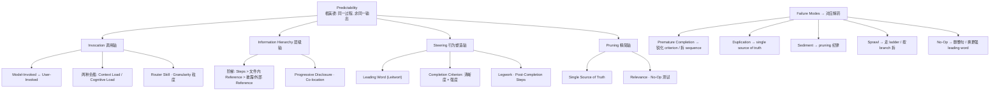

# `writing-great-skills` 分析报告

> 分析对象：[`mattpocock/skills` · `writing-great-skills`](https://github.com/mattpocock/skills/blob/main/skills/productivity/writing-great-skills/SKILL.md)
> 阅读范围：`SKILL.md`（正文）+ 它指向的 `GLOSSARY.md`（disclosed reference，全部加粗术语的定义都在那里）。两者构成一个完整自洽的元 skill。

---

## 1. 定位

一个**关于写 skill 的 meta-skill**——它不执行任何业务任务，而是定义"什么让一个 skill 可预测"。自身属性就是它教学的第一个案例：

- `disable-model-invocation: true` → **user-invoked**（只能手敲名字调用，不占 context）；
- 正文无任何 step → **all-reference**（正文自己声明 "_This skill is all reference._"）；
- 全部术语定义推迟到 `GLOSSARY.md` → **progressive disclosure** 的活样本。

它**边教边做**：正文演示的模式正是它讲授的模式。

## 2. 核心论点

> "A skill exists to **wrangle determinism out of a stochastic system**."
> "Predictability — the agent taking the same _process_ every run, not producing the same output — is the root virtue."

这是整篇最关键的概念动作：把"质量"的重心从**产出好不好**移到**过程是否可复现**。一个头脑风暴 skill 应当 "predictably diverge"——token 变、行为不变。以此为根，它进一步断言成本与可维护性都是 predictability 的"症状，而非对手"。这条断言强但可争论（见 §7）。

## 3. 概念模型（本体）

词汇沿四条轴组织，外加一组 **failure mode**，每个失败模式都配一个"治愈它的杠杆"——诊断导向。

## 4. 最值得吸收的几个杠杆

- **两种负载的权衡**：`context load`（model-invoked 的 description 每轮常驻，花 token+注意力）vs `cognitive load`（user-invoked，人要记住它存在）。**每一次拆分都花掉其中一种**——这是它做"要不要拆 skill"决策的经济学骨架。`router skill` 是 user-invoked 数量爆炸后治 cognitive load 的药。
- **信息层级阶梯**：`in-skill step > in-skill reference > disclosed/external reference`。两个切割维度：① 文件内 vs 指针后；② step vs reference。决策不是"能不能省 token"，而是"保护顶层的可读性"。
- **Completion Criterion 的两轴**：`clarity`（能否区分 done/not-done，对抗 premature completion）+ `demand`（要求多狠，决定 legwork 的彻底度）。关键洞察：**demand 轴对"无 step 的纯 reference"同样生效**——"every rule applied"这种穷尽式判据能让一个没有 step 的 review skill 也带上彻底性门槛。
- **Leading word / Leitwort**：用一个已存在于模型预训练里的紧凑词（_lesson_、_fog of war_、_tracer bullets_）去锚定一整片行为，靠"招募先验"而非"写定义"。它与 **No-Op 检验交叉**：一个太弱、打不过默认行为的 leading word 就是 no-op（`be thorough` 当 agent 本就偏 thorough 时无效），解药是换更强的词（`relentless`），而非换技术。
- **Pruning 纪律**：`single source of truth`（每个含义只在一处）+ `relevance`（这行还和任务相关吗）+ 逐句跑 `no-op` 测试（这行相对默认行为改变了吗），且"删整句，别抠字眼"。

## 5. 优点

1. **高度自洽**：正文用到的每个加粗词都在 GLOSSARY 有定义；每个术语带 `_Avoid_` 同义词清单——这本身就是它讲授的 single-source-of-truth + leading-word 纪律在词汇层的自我执行。漂亮的递归。
2. **失败模式驱动**：不空谈"好"，而是给五个可诊断的病（premature completion / duplication / sediment / sprawl / no-op），并按"先便宜后昂贵"排序解药（如 premature completion 先锐化判据、只有判据不可救药时才拆 sequence）。
3. **区分锋利**：`sprawl`（纯长度）vs `sediment`（陈年堆积的长度）vs `duplication`（重复含义的长度）；`relevance`（是否相关）vs `no-op`（是否改变行为）；`co-location`（同一含义聚拢）vs `duplication`（同一含义重复）。这些切分让诊断不会混为一谈。

## 6. 批评与局限

1. **抽象密度 / 术语门槛高**。约 25 个定义术语，正文几乎句句带加粗词，不打开 GLOSSARY 近乎不可读。按它自己的逻辑，这套词表本身就很重——一个"讲精简 skill 的 skill"需要先学 25 词词典，存在张力 _[INFERENCE]_。
2. **No-Op 检验模型相关、实践难落地**。它承认"两人争论一行是不是 no-op，其实是争论默认行为，靠跑、不靠辩论"——但没给度量。没有 A/B 对照时，这条最有用的纪律反而最难客观执行。
3. **部分处方是断言而非实证**。"leading word 招募预训练先验"、"藏起 post-completion steps 能抑制 premature completion"都合理，但以公理口吻给出，未给证据或反例 _[INFERENCE]_。整篇更像一位实践者的心智模型，自洽，但 _axiomatic_ 气息重。
4. **调用模型偏二值、可移植性有限**。model-invoked vs user-invoked 假设的是 Claude 式 `disable-model-invocation` 机制。对带显式 skill router、或 description 语义不同的系统（如我们的），词汇只能部分映射。
5. **轻微自指不一致**。正文 Failure modes 段对若干术语做了完整复述，而它们在 GLOSSARY 已有定义——按它自己的 duplication 标准，这算轻度重复。可辩护（正文须独立可用），但不是零。

## 7. 对我们 skill 系统的启示

我们的约定能干净地映射到这套词汇，说明方向一致，但有几处可借鉴加强：

| 它的概念 | 我们的现状 | 可借鉴动作 |
|---|---|---|
| External / disclosed reference | `skills/lib/*-format.md`（plan/context/adr/index）已是这样——多 skill 共享的单一真源 | 保持；确保 skill 正文**指而不复述**格式细节 |
| Progressive disclosure | 已有 domain rule（SKILL.md 精简、模板下沉 references/scripts） | 一致，继续 |
| Completion Criterion（clarity×demand） | 我们有"完成标准"，但 plan 级/step 级混在一起 | 给每个 step 配**可检查 + 必要时穷尽**的判据；尤其给 reference 类 skill 加 demand 轴 |
| Leading word | 我们多为描述性散文 | 做一轮 leading-word pass：把反复出现的道理压成预训练词 |
| Two-loads 决策 | grilling-me / grilling-with-context 的拆分其实正是此决策 | 显式用 context-load vs cognitive-load 框架论证未来拆分 |
| No-op 审计 | "不做什么"段 + 部分散文可能重述默认 | 跑一次 no-op + duplication 审计 |

**建议**（若要落地）：
1. 给现有 skill 加 leading-word 与 completion-criterion 两轮 pass；
2. 抽 3–4 个核心概念（predictability / 两负载 / 信息层级 / leading word）做中文落地，**不要**整本搬 25 词词典进我们系统（会违背中文读者的可读性）；
3. 把 `skills/lib` 的"单一真源"地位写进一条评审清单。

---

**一句话总结**：这是一份自洽、锋利、但门槛偏高的 skill 工程学；最大贡献是**把"skill 质量"重定义为"过程可复现性"**，并给出一套可诊断的失败模式词汇。对我们最有用的不是它的 25 个术语，而是它的**两个判断框架**——两负载权衡、信息层级阶梯——和一个**写法技巧**（leading word）。
