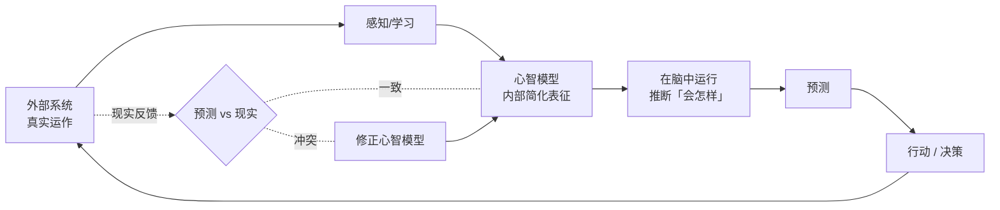

# 心智模型（Mental Model）—— 概念报告

> 撰写日期：2026-07-23
> 性质：概念释义报告
> 关联：本工作区 `grilling-me` SKILL.md §0「建立现状心智模型」、`如何书写并评价一个Skill-深度报告.md` 中多处提及该概念

---

## 摘要

**心智模型（mental model）** 是人或智能体在头脑中对外部某个系统 / 领域 / 问题**如何运作**所建立的**内部表征**——一个简化的、可用来跑「如果…会怎样」模拟的小世界。它的核心用途是**预测**系统行为、解释现象、做出决策，而不必每次都实地试错。

一句话：**心智模型是你脑子里那个用来「想清楚某件事会怎么发展」的简化模拟器。** 它准，你预测就准；它偏，你就系统性地犯错。

---

## 一、定义

心智模型是认知主体对外部现实的一种**内部小规模模型**：主体在其中复现外部系统的关键要素与要素间的因果/结构关系，并能在模型上「运行」以推断外部系统在特定输入下会产生什么输出。

它的根本价值是**预测**——让人在行动前就能预见结果，从而规避试错成本与不可逆风险。

---

## 二、关键特征

| 特征 | 含义 |
|---|---|
| **简化的** | 它是世界的近似，不是世界本身；只保留对预测有用的部分，舍弃细节 |
| **预测性的** | 核心用途是在脑中「运行」模型推断结果（「按下这个按钮会…」「这样改会导致…」） |
| **因果的** | 包含「A 导致 B」的因果链与结构关系，而非零散事实的堆砌 |
| **可证伪 / 可修正的** | 与现实冲突时会被更新；与现实不符的心智模型正是错误与 bug 的来源 |
| **私人的 / 可能失真** | 它存在于个体脑中，可能不完整、有偏差，不同人对同一系统的心智模型不同 |

---

## 三、工作机制

心智模型以「**预测 → 对照现实 → 修正**」的闭环运作：

当预测与现实**一致**，心智模型被强化；当**冲突**，要么修正模型（学习），要么——若固执不改——就会持续犯系统性错误。

---

## 四、概念溯源

| 人物 / 年份 | 贡献 |
|---|---|
| **Kenneth Craik**（1943《The Nature of Explanation》） | 最早提出：有机体在脑中构建外部现实的「小规模模型」，用它预测事件、规避危险，是思维与推理的底层机制 |
| **Philip Johnson-Laird**（1983《Mental Models》） | 认知科学系统化：人类推理的本质是**操作心智模型**，而非运用形式逻辑——这解释了人为何会在推理中系统性出错 |
| **Don Norman**（1988《The Design of Everyday Things》） | 带入设计与 HCI：用户对系统的心智模型，与设计者通过界面提供的**系统意象（system image）**之间的**差距**，是可用性问题（按错、不会用、挫败）的根源 |

---

## 五、Norman 的三件套（设计的核心洞察）

Norman 用三个概念解释「为什么人会误用产品」，这是心智模型最实用的展开：

| 概念 | 是谁的 | 说明 |
|---|---|---|
| **设计者模型** | 设计者脑中 | 设计者以为系统如何运作 |
| **用户心智模型** | 用户脑中 | 用户根据所见所感，推断系统如何运作 |
| **系统意象（system image）** | 界面上 | 用户**唯一能接触到**的部分——按钮、提示、反馈 |

> 关键洞察：设计者与用户**不直接沟通**，只通过「系统意象」间接对齐。**好的设计 = 系统意象能让用户构建出与设计者一致的心智模型。** 当系统意象误导（如把手长得像「拉」却要「推」），用户的心智模型就出错。

---

## 六、一个直觉例子

你面对一扇门：推还是拉？你脑中有个「门」的心智模型——合页在哪、把手形状暗示什么方向、哪个位置该用力。若门把手长得像「拉」但实际要「推」，你的心智模型与门的实际行为冲突——你就在门上撞一下。

这不是你笨，而是**系统意象（把手形状）误导了你的心智模型**。好设计（如平板表示「推」、把手表示「拉」）让用户的心智模型自然与系统对齐，无需标识也能用对。

---

## 七、在不同领域的含义

| 语境 | 「心智模型」指什么 |
|---|---|
| **认知科学 / HCI** | 人脑对系统运作的内部表征（本报告主线定义） |
| **软件工程** | 程序员对代码库 / 架构的理解——各模块如何交互、数据如何流动、状态如何变迁。**读代码、读架构图，本质就是在构建心智模型**；好代码 = 让心智模型容易建且准确 |
| **系统思考 / 决策**（Peter Senge《第五项修炼》） | 改善决策要先**揭出并改善心智模型**中隐藏的假设——许多决策失误源于过时或错误的心智模型 |
| **教学 / 沟通** | 教学的本质是**帮学习者构建正确的心智模型**；讲清楚因果与结构，胜过堆砌定义 |
| **Agent / AI**（本工作区语境） | 让 agent 动手前先扫描既有代码 / 上下文，形成对系统**当前状态与结构**的内部表征，以便后续判断 |

---

## 八、在本工作区的具体语境

本工作区 `grilling-me` SKILL.md §0 有「建立现状心智模型（可选）」一条。其确切含义：

> 让 agent 在盘问一份设计**之前**，先 `glob` / `grep` 涉及的源码与既有上下文，**在脑中搭起「系统现在长什么样」的模型**，以便盘问中能「用代码印证用户陈述」——即判断用户所说是否与这个既有心智模型一致，发现矛盾即当场揭出。

没有这一步，agent 只能凭用户单方面陈述判断，无法交叉验证。所以「建立现状心智模型」= **让 agent 先获取一份与用户陈述可比对的客观参照系**。

> 旁注：`如何书写并评价一个Skill-深度报告.md` 第二章也指出，grilling-me 把这一步标为「（可选）」存在张力——§1「能查就别问」与 §2「用代码印证」都依赖已扫过代码，标「可选」会让 agent 倾向跳过，从而削弱印证能力。

---

## 九、易混区分（中文翻译陷阱）

中文里 **mental model** 有两个常见译法，**语境不同、所指不同**，极易混淆：

| 译法 | 语境 | 所指 |
|---|---|---|
| **心智模型** | 认知科学 / HCI / 软件工程 / AI | 对**某个具体系统**如何运作的**内部表征**（本报告主线） |
| **思维模型** | Charlie Munger 的「latticework of mental models」/ 投资 / 决策 | **一组跨学科的思维框架**——机会成本、第二性原理、复利、反向思考、概率思维…，作为思考的工具箱 |

两者英文同源，但中文里指的东西不同：

- 前者是**「对某个系统的理解」**（singular，针对对象）；
- 后者是**「用来思考的工具集合」**（plural，针对方法）。

本报告及本工作区所用，均为前者。

---

## 十、为什么重要

1. **预测的准确度 ≈ 心智模型的准确度。** 无论设计产品、写代码、还是盘问一个设计，成败都取决于你的心智模型与现实的吻合度。
2. **系统性错误的根源通常是失真的心智模型**，而非偶发失误——不修正模型，错误会反复。
3. **沟通与教学的本质是传递/共建心智模型**：让对方脑中建立起与你一致（且与现实一致）的模型，比让对方记住一堆结论更可靠。

> 因此，无论是做产品设计、写 skill、还是 agent 执行任务，核心工作都可以归结为一句话：**校准心智模型，使之与现实一致——既校准自己的，也帮助他人（与 agent）构建正确的。**

---

## 附录：延伸阅读

- Kenneth Craik《The Nature of Explanation》（1943）
- Philip Johnson-Laird《Mental Models: Towards a Cognitive Science of Language, Inference, and Consciousness》（1983）
- Don Norman《The Design of Everyday Things》（1988，中文译《设计心理学》）
- Peter Senge《The Fifth Discipline》（1990，中文译《第五项修炼》）——「改善心智模型」作为学习型组织的核心修炼之一
- Charlie Munger《Poor Charlie's Almanack》——「思维模型」格栅（注意：此为 mental model 的另一中文译法与语境，见第九节区分）

---

*本报告为概念释义，内容基于认知科学与设计领域的成熟共识；文中引用的本工作区文件路径均为实证锚点。*
